# JavaWeb

map函数用于将数据转化

```java
//用户信息controller
@RestController//表示当前类是一个请求处理类   包含了@Controller @ResponseBody作用:将controller返回的数据(对象/集合)以json格式返回给前端
public class UserController {
    @RequestMapping("/list")
    public List<User> list() throws Exception {
        //加载读取user.txt获取用户列表
        InputStream in = this.getClass().getClassLoader().getResourceAsStream("user.txt");
        ArrayList<String> lines = IoUtil.readLines(in, StandardCharsets.UTF_8, new ArrayList<String>());
        //遍历用户列表
        List<User> userList = lines.stream().map(line ->
        {
            String[] parts = line.split(",");
            Integer id = Integer.parseInt(parts[0]);
            String username = parts[1];
            String password = parts[2];
            String name = parts[3];
            Integer age = Integer.parseInt(parts[4]);
            LocalDateTime updateTime = LocalDateTime.parse(parts[5], DateTimeFormatter.ofPattern("yyyy-MM-dd HH:mm:ss"));
            return new User(id, username, password, name, age, updateTime);
        }).toList();

        //返回数据(json)
        return userList;
    }
}
```

解耦合,使用JavaSpring框架依赖注入

- 使用@Component将一个类交给IOC容器管理,衍生注解:
  - @Controller 控制层
  - @Service 业务层
  - @Repository 数据访问层
- 使用@Autowired从IOC容器找到该类型bean完成依赖注入

```java
@Component
public class UserServiceImpl implements Userservice {
    @Autowired
    private UserDaoImpl userDao;

    @Override
    public List<User> findAll() {
        List<String> lines = userDao.findAll();
        //遍历用户列表
        List<User> userList = lines.stream().map(line ->
        {
            String[] parts = line.split(",");
            Integer id = Integer.parseInt(parts[0]);
            String username = parts[1];
            String password = parts[2];
            String name = parts[3];
            Integer age = Integer.parseInt(parts[4]);
            LocalDateTime updateTime = LocalDateTime.parse(parts[5], DateTimeFormatter.ofPattern("yyyy-MM-dd HH:mm:ss"));
            return new User(id, username, password, name, age, updateTime);
        }).toList();
        return userList;
    }
}
```

- 前面声明bean的四大注解，要想生效，还需要被组件扫描注解 `@ComponentScan` 扫描。
- 该注解虽然没有显式配置，但是实际上已经包含在了启动类声明注解 `@SpringBootApplication` 中，默认扫描的范围是启动类所在包及其子包。

@Autowired 进行依赖注入，常见的方式，有如下三种：

1). 属性注入

```Java
@RestController
public class UserController {

    //方式一: 属性注入
    @Autowired
    private UserService userService;
    
  }
```

- 优点：代码简洁、方便快速开发。
- 缺点：隐藏了类之间的依赖关系、可能会破坏类的封装性。

2). 构造函数注入

```Java
@RestController
public class UserController {

    //方式二: 构造器注入
    private final UserService userService;
    
    @Autowired //如果当前类中只存在一个构造函数, @Autowired可以省略
    public UserController(UserService userService) {
        this.userService = userService;
    }
    
 }   
```

- 优点：能清晰地看到类的依赖关系、提高了代码的安全性。
- 缺点：代码繁琐、如果构造参数过多，可能会导致构造函数臃肿。
- **注意：如果只有一个构造函数，@Autowired注解可以省略。（通常来说，也只有一个构造函数）**

3). setter注入

```Java
/**
 * 用户信息Controller
 */
@RestController
public class UserController {
    
    //方式三: setter注入
    private UserService userService;
    
    @Autowired
    public void setUserService(UserService userService) {
        this.userService = userService;
    }
    
}    
```

- 优点：保持了类的封装性，依赖关系更清晰。
- 缺点：需要额外编写setter方法，增加了代码量。

**存在多个相同类型的bean对象怎么办?**

- @Primary
- @Qualifier
- @Resource

**方案一：使用@Primary注解**

当存在多个相同类型的Bean注入时，加上@Primary注解，来确定默认的实现。

```Java
@Primary
@Service
public class UserServiceImpl implements UserService {
}
```

**方案二：使用@Qualifier注解**

指定当前要注入的bean对象。 在@Qualifier的value属性中，指定注入的bean的名称。 @Qualifier注解不能单独使用，必须配合@Autowired使用。

```Java
@RestController
public class UserController {

    @Qualifier("userServiceImpl")
    @Autowired
    private UserService userService;
```

**方案三：使用@Resource注解**

是按照bean的名称进行注入。通过name属性指定要注入的bean的名称。

```Java
@RestController
public class UserController {
        
    @Resource(name = "userServiceImpl")
    private UserService userService;
```

## 前后端

前端-->后端:通过HTTP请求体将JSON字符串

后端-->前端:Result Java 对象(Spring Boot 自动转为 JSON 发送)

## 数据库

Result 对象是后端接口统一响应结果封装类，用于规范后端返回给前端的数据格式。
简单理解
Result 对象就像一个快递包装盒，后端返回的所有数据都要装进这个盒子里再交给前端。
核心结构

```java
public class Result<T> {
    private Integer code;      // 状态码：200 表示成功，500 表示失败
    private String msg;        // 提示信息：如"操作成功"、"用户不存在"
    private T data;            // 实际数据：如用户信息、商品列表等
}
```

### MyBatis(持久层框架)

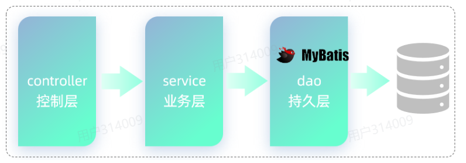

三层结构

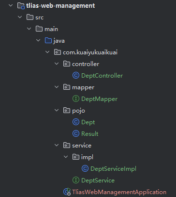

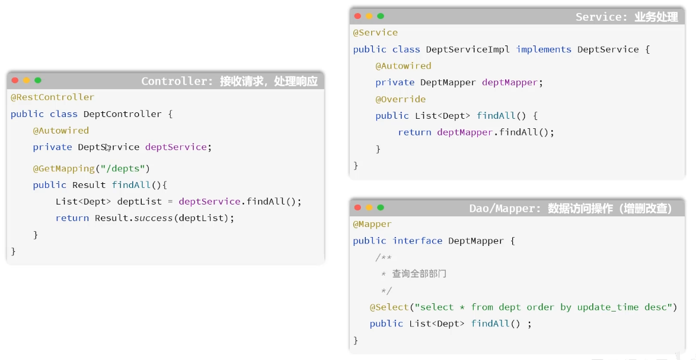

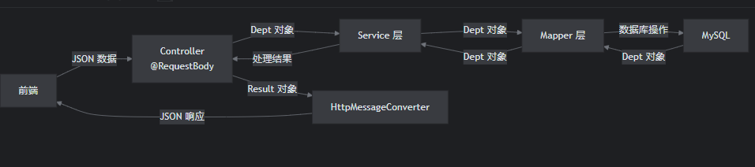

Spring Framework
    └── Spring MVC
        └── HttpMessageConverter  ← 消息转换器 

Spring 框架将 Result 对象转成 JSON

```java
    @PostMapping("/depts")//@RequestBody注解：将前端传递的json数据转为java对象
    public Result save(@RequestBody Dept dept) {
        System.out.println("保存部门数据"+dept);
        deptService.save(dept);
        return Result.success("保存成功");
    }
```

@RestController=@ResponseBody+@Controller

@ResponseBody作用:将controller返回的数据(对象/集合)以json格式返回给前端 ← 所有方法的返回值都直接写入响应体（不跳转页面）

@Controller用于标记一个类是 Spring MVC 的控制器，负责处理 Web 请求

@RequestBody注解：将前端传递的json数据转为java对象


```java
@GetMapping("/depts/{id}")
public Result get(@PathVariable("id") Integer id) {
    System.out.println("查询部门数据"+id);
    Dept dept =deptService.findById(id);
    return Result.success(dept);
}
```

{}为占位符,使用@PathVariable绑定路径 名称相同@PathVariable的属性值可省略

### **内连接**

**隐式内连接语法：**

```SQL
select  字段列表   from   表1 , 表2   where  条件 ... ;
select emp.id, emp.name, dept.name from emp , dept where emp.dept_id = dept.id;
```

**显式内连接语法：**

```SQL
select  字段列表   from   表1  [ inner ]  join 表2  on  连接条件 ... ;
select emp.id, emp.name, dept.name from emp inner join dept on emp.dept_id = dept.id;
```

### 外连接

**左外连接语法：**

```SQL
select  字段列表   from   表1  left  [ outer ]  join 表2  on  连接条件 ... ;
字左边的表为主表，查询主表中所有数据，以及和主表匹配的右边表中的数据
select e.name , d.name  from emp as e left join dept as d on e.dept_id = d.id ;
```

**右外连接语法：**

```SQL
select  字段列表   from   表1  right  [ outer ]  join 表2  on  连接条件 ... ;
-- 右外连接：以right join关键字右边的表为主表，查询主表中所有数据，以及和主表匹配的左边表中的数据
select e.name , d.name from emp as e right join dept as d on e.dept_id = d.id;
```

### 子查询

1. 标量子查询（子查询结果为单个值 [一行一列]）

   ```SQL
   -- 1. 查询最早的入职时间
   select min(entry_date) from emp;  -- 结果: 2000-01-01
   
   -- 2. 查询入职时间 = 最早入职时间的员工信息
   select * from emp where entry_date = '2000-01-01';
   
   -- 3. 合并为一条SQL
   select * from emp where entry_date = (select min(entry_date) from emp);
   ```

2. 列子查询（子查询结果为一列，但可以是多行）

   ```SQL
   -- 1. 查询 "教研部" 和 "咨询部" 的部门ID
   select id from dept where name = '教研部' or name = '咨询部'; -- 结果: 3,2
   
   -- 2. 根据上面查询出来的部门ID, 查询员工信息
   select * from emp where dept_id in(3,2);
   
   -- 3. 合并SQL为一条SQL语句
   select * from emp where dept_id in (select id from dept where name = '教研部' or name = '咨询部');
   ```

3. 行子查询（子查询结果为一行，但可以是多列）

   ```SQL
   -- 1. 查询 "李忠" 的薪资和职位
   select salary , job from emp where name = '李忠'; -- 结果: 5000, 5
   
   -- 2. 根据上述查询到的薪资和职位 , 查询对应员工的信息
   select * from emp where (salary, job) = (5000,5);
   
   -- 3. 将两条SQL合并为一条SQL
   select * from emp where (salary, job) = (select salary , job from emp where name = '李忠');
   ```

4. 表子查询（子查询结果为多行多列[相当于子查询结果是一张表]）

   ```SQL
   -- a. 获取每个部门的最高薪资
   select dept_id, max(salary) from emp group by dept_id;
   
   -- b. 查询每个部门中薪资最高的员工信息
   select * from emp e , (select dept_id, max(salary) max_sal from emp group by dept_id) a
       where e.dept_id = a.dept_id and e.salary = a.max_sal;
   ```

**分组后只能查询出现在 GROUP BY 子句中的列（分组字段）, 聚合函数的结果**

### PageHelper分页插件

- PageHelper实现分页查询时，SQL语句的结尾一定一定一定不要加分号(;).。
- PageHelper只会对紧跟在其后的第一条SQL语句进行分页处理。

### 动态SQL

`<if>`：判断条件是否成立，如果条件为true，则拼接SQL。

`<where>`：根据查询条件，来生成where关键字，并会自动去除条件前面多余的and或or。

```sql
<mapper namespace="com.kuaiyukuaikuai.mapper.EmpMapper">
    <select id="list" resultType="com.kuaiyukuaikuai.pojo.Emp">
        select e.*, d.name deptName from emp as e left join dept as d on e.dept_id = d.id
        <where>
            <if test="name != null and name != ''">
                e.name like concat('%',#{name},'%')
            </if>
            <if test="gender != null">
                and e.gender = #{gender}
            </if>
            <if test="begin != null and end != null">
                and e.entry_date between #{begin} and #{end}
            </if>
        </where>
    </select>
</mapper>
```

Mybatis中的动态SQL里提供的 `<foreach>` 标签，改标签的作用，是用来遍历循环，常见的属性说明：

1. collection：集合名称
2. item：集合遍历出来的元素/项
3. separator：每一次遍历使用的分隔符
4. open：遍历开始前拼接的片段
5. close：遍历结束后拼接的片段

```sql
<!--    批量保存员工工作经历信息-->
    <insert id="insertBatch">
        insert into emp_expr(emp_id, begin, end, company, job) values
        <foreach collection="exprList" item="expr" separator=",">
            (#{expr.empId},#{expr.begin},#{expr.end},#{expr.company},#{expr.job})
        </foreach>
    </insert>
```

<set> 是 MyBatis 动态 SQL 标签，专门用于 UPDATE 语句
✅ 作用：自动生成 SET 关键字 + 智能处理字段间的逗号

```sql
<update id="updateById">
    update emp
    <set>
        <if test="username != null and username != ''">username = #{username},</if>
        <if test="password != null and password != ''">password = #{password},</if>
        <if test="name != null and name != ''">name = #{name},</if>
        <if test="gender != null">gender = #{gender},</if>
        <if test="phone != null and phone != ''">phone = #{phone},</if>
        <if test="job != null">job = #{job},</if>
        <if test="salary != null">salary = #{salary},</if>
        <if test="image != null and image != ''">image = #{image},</if>
        <if test="entryDate != null">entry_date = #{entryDate},</if>
        <if test="deptId != null">dept_id = #{deptId},</if>
        <if test="updateTime != null">update_time = #{updateTime},</if>
    </set>
    where id = #{id}
</update>
```

### 事务管理

```java
@Transactional(rollbackFor = {Exception.class})//事务管理,出现异常回滚,默认出现异常RuntimeException才回滚
@Transactional(propagation = Propagation.REQUIRES_NEW)
```

我们要想控制事务的传播行为，在@Transactional注解的后面指定一个属性propagation，通过 propagation 属性来指定传播行为。接下来我们就来介绍一下常见的事务传播行为。

| 属性值               | 含义                                                         |
| -------------------- | ------------------------------------------------------------ |
| ==**REQUIRED**==     | ==**【默认值】需要事务，有则加入，无则创建新事务**==         |
| ==**REQUIRES_NEW**== | ==**需要新事务，无论有无，总是创建新事务**==                 |
| SUPPORTS             | 支持事务，有则加入，无则在无事务状态中运行                   |
| NOT_SUPPORTED        | 不支持事务，在无事务状态下运行,如果当前存在已有事务,则挂起当前事务 |
| MANDATORY            | 必须有事务，否则抛异常                                       |
| NEVER                | 必须没事务，否则抛异常                                       |

## 注解

```java
@Component
@ConfigurationProperties(prefix = "aliyun.oss")
```

@Component:Spring 框架的注解,用于告诉 Spring是一个 Bean(组件)

@ConfigurationProperties:用于绑定前缀不用和@Value一个一个注入

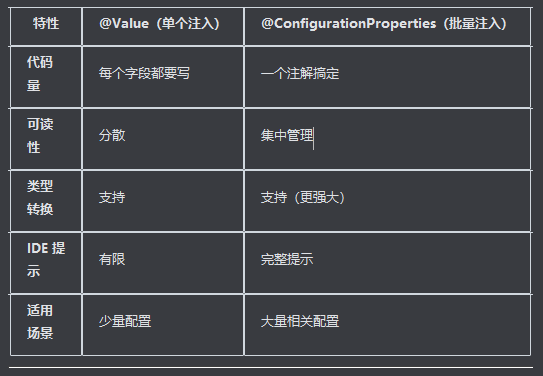

## 全局异常处理器

- 定义全局异常处理器非常简单，就是定义一个类，在类上加上一个注解@RestControllerAdvice，加上这个注解就代表我们定义了一个全局异常处理器。
- 在全局异常处理器当中，需要定义一个方法来捕获异常，在这个方法上需要加上注解@ExceptionHandler。通过@ExceptionHandler注解当中的value属性来指定我们要捕获的是哪一类型的异常。

```Java
@RestControllerAdvice
public class GlobalExceptionHandler {
    
    //处理异常
    @ExceptionHandler
    public Result ex(Exception e){//方法形参中指定能够处理的异常类型
        e.printStackTrace();//打印堆栈中的异常信息
        //捕获到异常之后，响应一个标准的Result
        return Result.error("对不起,操作失败,请联系管理员");
    }
    
}
```

@RestControllerAdvice = @ControllerAdvice + @ResponseBody

处理异常的方法返回值会转换为json后再响应给前端

## map和list区别

```java
List<String> names = new ArrayList<>();
names.add("张三");
names.add("李四");
names.add("王五");
// 缺点：只有名字，没有其他信息

Map<String, Object> zhangsan = new HashMap<>();
zhangsan.put("name", "张三");
zhangsan.put("age", 18);
zhangsan.put("gender", "男");
// 缺点：只能存一个人的信息

List<Map> genderList = [
  {"name": "男", "value": 15},
  {"name": "女", "value": 8},
  {"name": "未知", "value": 2}  // 自动添加，无需改结构
];
```

## 过滤器Filter和拦截器Interceptor

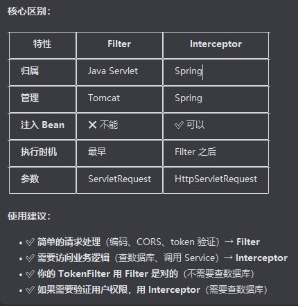

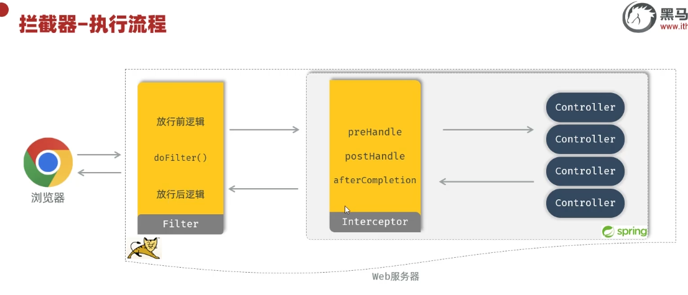

WebConfig 是"装配工"，负责把拦截器安装到 Spring MVC 框架中
TokenInterceptor 是"保安"，负责具体的 token 验证工作
两者配合实现了全站的 token 认证机制（登录接口除外）

**==WebConfig.java==** - 配置类
实现 WebMvcConfigurer 接口
负责注册和配置拦截器
通过 @Autowired 注入 TokenInterceptor 实例
在 addInterceptors() 方法中将拦截器注册到 Spring MVC 的拦截器注册表中
设置拦截路径为 /**（拦截所有请求）
==TokenInterceptor.java== - 拦截器实现
实现 HandlerInterceptor 接口
包含具体的令牌验证逻辑
在 preHandle() 方法中实现：
检查是否为登录请求（放行）
获取并验证 JWT token
根据 token 有效性决定是否放行请求

## AOP(底层:动态代理技术)

- 减少重复代码：不需要在业务方法中定义大量的重复性的代码，只需要将重复性的代码抽取到AOP程序中即可。
- 代码无侵入：在基于AOP实现这些业务功能时，对原有的业务代码是没有任何侵入的，不需要修改任何的业务代码。
- 提高开发效率
- 维护方便

```java
@Component
@Aspect //当前类为切面类
@Slf4j
public class RecordTimeAspect {

    @Around("execution(* com.itheima.service.impl.DeptServiceImpl.*(..))") //作用范围
    public Object recordTime(ProceedingJoinPoint pjp) throws Throwable {
        //记录方法执行开始时间
        long begin = System.currentTimeMillis();

        //执行原始方法
        Object result = pjp.proceed();

        //记录方法执行结束时间
        long end = System.currentTimeMillis();

        //计算方法执行耗时
        log.info("方法{}执行耗时: {}毫秒",pjp.getSignature(),end-begin);
        return result;
    }
}

//可以使用@Pointcut
@Pointcut("execution(* com.itheima.service.impl.DeptServiceImpl.*(..))")
    public void pt(){}

    @Around("pt()")
```

- **连接点：**JoinPoint，可以被AOP控制的**方法**（暗含方法执行时的相关信息）
  - 连接点指的是可以被aop控制的方法。例如：入门程序当中所有的业务方法都是可以被aop控制的方法。
  - 在SpringAOP提供的JoinPoint当中，封装了连接点方法在执行时的相关信息。（后面会有具体的讲解）
  - 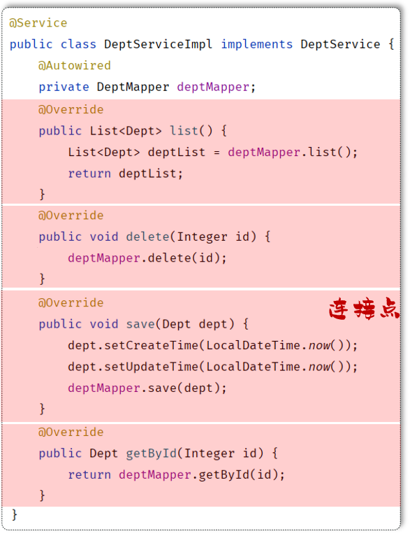

- **通知：**Advice，指哪些重复的逻辑，也就是共性功能（最终体现为一个方法）
  - 在入门程序中是需要统计各个业务方法的执行耗时的，此时我们就需要在这些业务方法运行开始之前，先记录这个方法运行的开始时间，在每一个业务方法运行结束的时候，再来记录这个方法运行的结束时间。
  - 是在AOP面向切面编程当中，我们只需要将这部分重复的代码逻辑抽取出来单独定义。抽取出来的这一部分重复的逻辑，也就是共性的功能。
  - 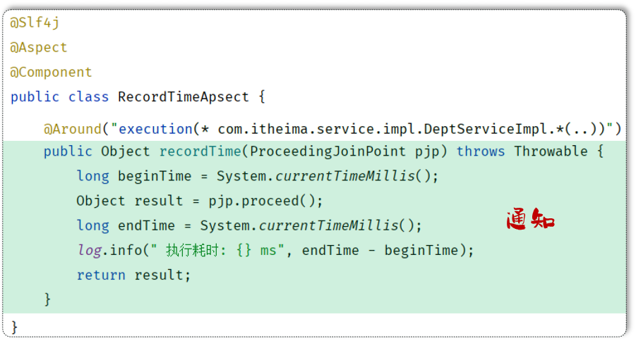

- **切入点：**PointCut，匹配连接点的**条件**，通知仅会在切入点方法执行时被应用。
  - 在通知当中，我们所定义的共性功能到底要应用在哪些方法上？此时就涉及到了切入点pointcut概念。切入点指的是匹配连接点的条件。通知仅会在切入点方法运行时才会被应用。
  - 在aop的开发当中，我们通常会通过一个切入点表达式来描述切入点(后面会有详解)。
  - 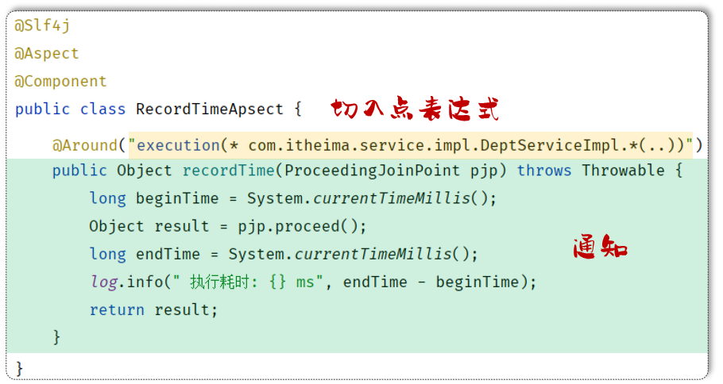
  - 假如：切入点表达式改为DeptServiceImpl.list()，此时就代表仅仅只有list这一个方法是切入点。只有list()方法在运行的时候才会应用通知。

- **切面：Aspect**，描述通知与切入点的对应关系（通知+切入点）

当通知和切入点结合在一起，就形成了一个切面。通过切面就能够描述当前aop程序需要针对于哪个原始方法，在什么时候执行什么样的操作。

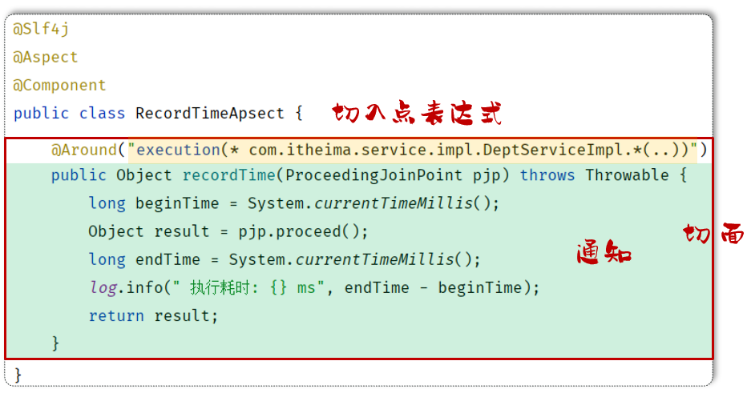

而切面所在的类，称之为切面类（被`@Aspect`注解标识的类）。

- **目标对象：Target**，通知所应用的对象

目标对象指的就是通知所应用的对象，我们就称之为目标对象。

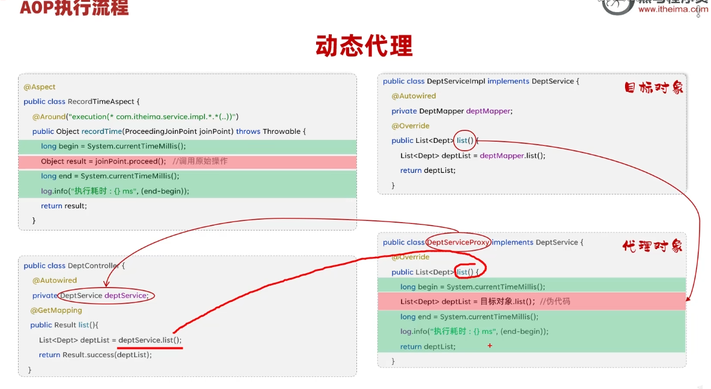

| **Spring AOP 通知类型** |                                                              |
| ----------------------- | ------------------------------------------------------------ |
| @Around                 | 环绕通知，此注解标注的通知方法在目标方法前、后都被执行       |
| @Before                 | 前置通知，此注解标注的通知方法在目标方法前被执行             |
| @After                  | 后置通知，此注解标注的通知方法在目标方法后被执行，无论是否有异常都会执行 |
| @AfterReturning         | 返回后通知，此注解标注的通知方法在目标方法后被执行，有异常不会执行 |
| @AfterThrowing          | 异常后通知，此注解标注的通知方法发生异常后执行               |

程序发生异常的情况下：

- @AfterReturning标识的通知方法不会执行，@AfterThrowing标识的通知方法执行了
- @Around环绕通知中原始方法调用时有异常，通知中的环绕后的代码逻辑也不会在执行了 （因为原始方法调用已经出异常了）

在使用通知时的注意事项：

- @Around环绕通知需要自己调用 ProceedingJoinPoint.proceed() 来让原始方法执行，其他通知不需要考虑目标方法执行
- @Around环绕通知方法的返回值，必须指定为Object，来接收原始方法的返回值，否则原始方法执行完毕，是获取不到返回值的。

### 执行顺序

默认按照切面类的类名字母排序, 修改使用`@Order`注解  1234321  4为切入点

```Java
@Slf4j
@Component
@Aspect
@Order(1) //切面类的执行顺序（前置通知：数字越小先执行; 后置通知：数字越小越后执行）
public class MyAspect4 {
    //前置通知
    @Before("execution(* com.itheima.service.*.*(..))")
    public void before(){
        log.info("MyAspect4 -> before ...");
    }

    //后置通知
    @After("execution(* com.itheima.service.*.*(..))")
    public void after(){
        log.info("MyAspect4 -> after ...");
    }
}
```

```Java
@Slf4j
@Component
@Aspect
@Order(2)  //切面类的执行顺序（前置通知：数字越小先执行; 后置通知：数字越小越后执行）
public class MyAspect2 {
    //前置通知
    @Before("execution(* com.itheima.service.*.*(..))")
    public void before(){
        log.info("MyAspect2 -> before ...");
    }

    //后置通知 
    @After("execution(* com.itheima.service.*.*(..))")
    public void after(){
        log.info("MyAspect2 -> after ...");
    }
}
```

```Java
@Slf4j
@Component
@Aspect
@Order(3)  //切面类的执行顺序（前置通知：数字越小先执行; 后置通知：数字越小越后执行）
public class MyAspect3 {
    //前置通知
    @Before("execution(* com.itheima.service.*.*(..))")
    public void before(){
        log.info("MyAspect3 -> before ...");
    }

    //后置通知
    @After("execution(* com.itheima.service.*.*(..))")
    public void after(){
        log.info("MyAspect3 ->  after ...");
    }
}
```

### execution

execution主要根据方法的返回值、包名、类名、方法名、方法参数等信息来匹配，语法为：

```Java
execution(访问修饰符?  返回值  包名.类名.?方法名(方法参数) throws 异常?)
```

其中带`?`的表示可以省略的部分

- 访问修饰符：可省略（比如: public、protected）
- 包名.类名： 可省略
- throws 异常：可省略（注意是方法上声明抛出的异常，不是实际抛出的异常）

示例：

```Java
@Before("execution(void com.itheima.service.impl.DeptServiceImpl.delete(java.lang.Integer))")
```

可以使用通配符描述切入点

- `*` ：单个独立的任意符号，可以通配任意返回值、包名、类名、方法名、任意类型的一个参数，也可以通配包、类、方法名的一部分
- `..` ：多个连续的任意符号，可以通配任意层级的包，或任意类型、任意个数的参数

切入点表达式的语法规则：

1. 方法的访问修饰符可以省略
2. 返回值可以使用`*`号代替（任意返回值类型）
3. 包名可以使用`*`号代替，代表任意包（一层包使用一个`*`）
4. 使用`..`配置包名，标识此包以及此包下的所有子包
5. 类名可以使用`*`号代替，标识任意类
6. 方法名可以使用`*`号代替，表示任意方法
7. 可以使用 `*`  配置参数，一个任意类型的参数
8. 可以使用`..` 配置参数，任意个任意类型的参数

### @annotation

**自定义注解**：`LogOperation`

```Java
@Target(ElementType.METHOD)
@Retention(RetentionPolicy.RUNTIME)
public @interface LogOperation{
}
```

**业务类**：`DeptServiceImpl`

```Java
@Slf4j
@Service
public class DeptServiceImpl implements DeptService {
    @Autowired
    private DeptMapper deptMapper;

    @Override
    @LogOperation //自定义注解（表示：当前方法属于目标方法）
    public List<Dept> list() {
        List<Dept> deptList = deptMapper.list();
        //模拟异常
        //int num = 10/0;
        return deptList;
    }

    @Override
    @LogOperation //自定义注解（表示：当前方法属于目标方法）
    public void delete(Integer id) {
        //1. 删除部门
        deptMapper.delete(id);
    }


    @Override
    public void save(Dept dept) {
        dept.setCreateTime(LocalDateTime.now());
        dept.setUpdateTime(LocalDateTime.now());
        deptMapper.save(dept);
    }

    @Override
    public Dept getById(Integer id) {
        return deptMapper.getById(id);
    }

    @Override
    public void update(Dept dept) {
        dept.setUpdateTime(LocalDateTime.now());
        deptMapper.update(dept);
    }
}
```

**切面类**

```Java
@Slf4j
@Component
@Aspect
public class MyAspect6 {
    //针对list方法、delete方法进行前置通知和后置通知

    //前置通知
    @Before("@annotation(com.itheima.anno.LogOperation)")
    public void before(){
        log.info("MyAspect6 -> before ...");
    }
    
    //后置通知
    @After("@annotation(com.itheima.anno.LogOperation)")
    public void after(){
        log.info("MyAspect6 -> after ...");
    }
}
```

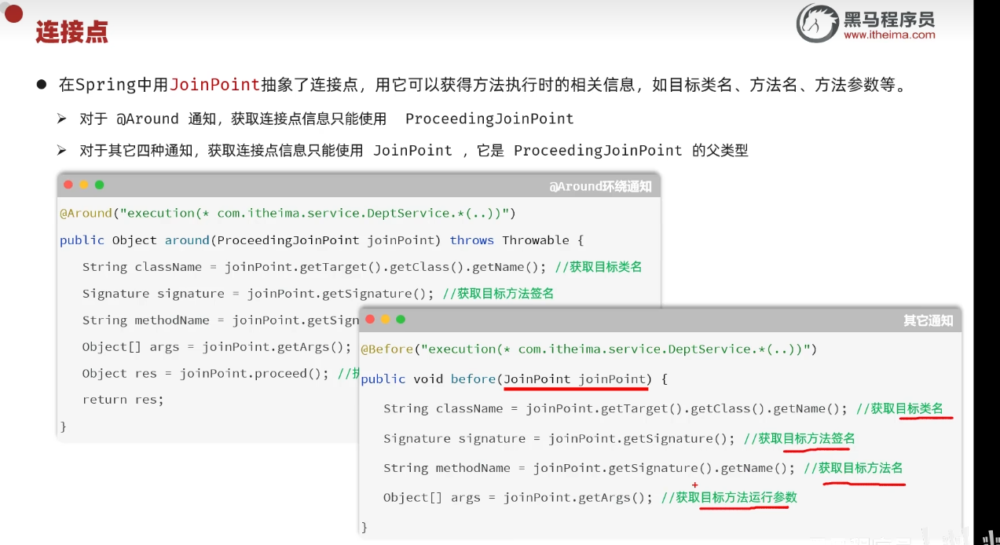
